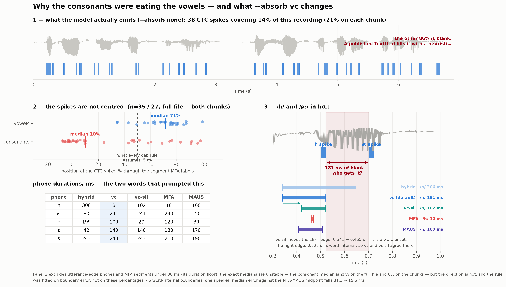
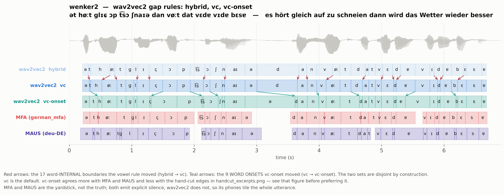
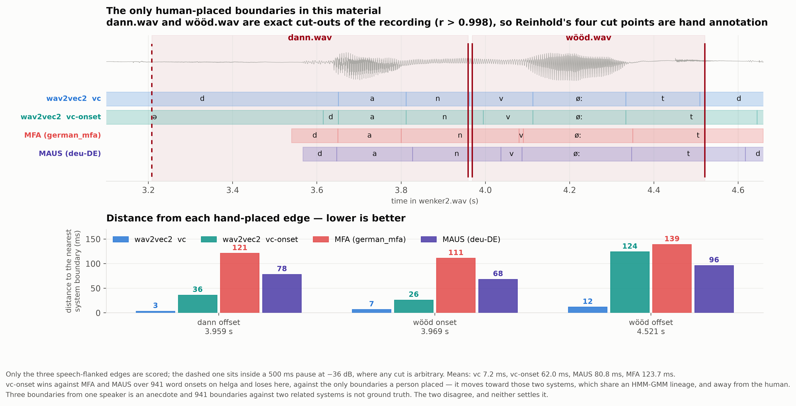
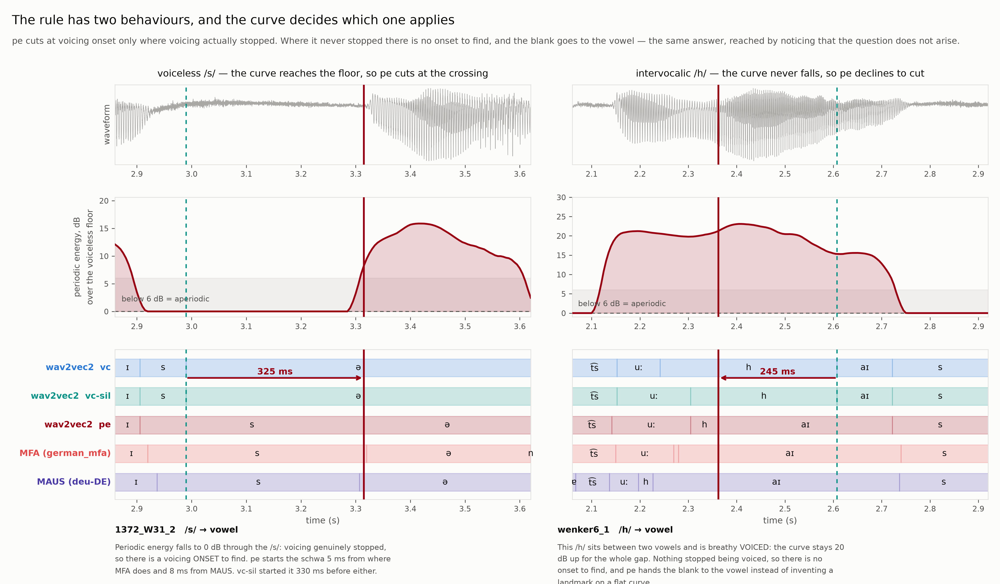
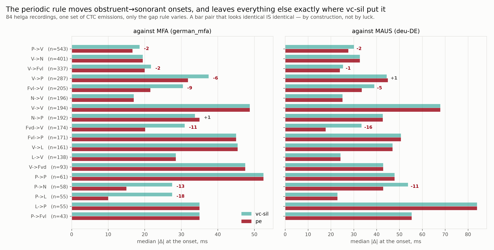
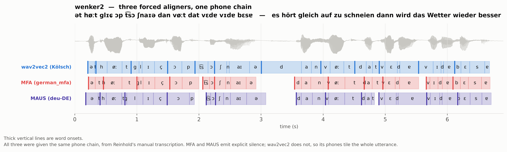
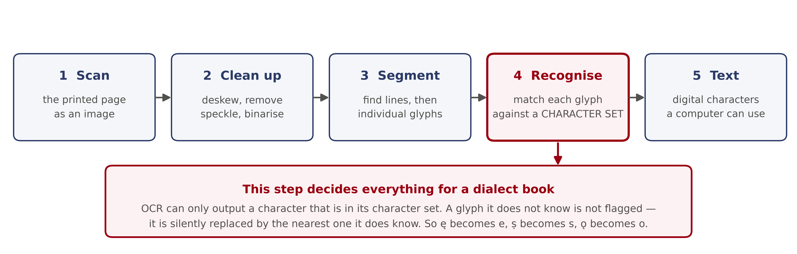
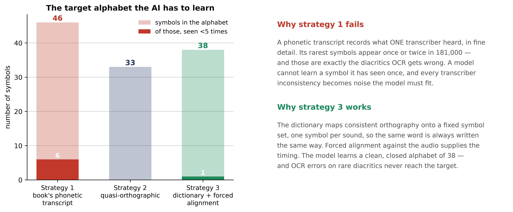

# Kölsch Phoneme Recognition

**Speech technology for Kölsch** (Ripuarian German, Cologne) — a reproducible
pipeline that turns a printed 1998 dialect corpus and its four audio CDs into a
fine-tuned phoneme recogniser, an orthographic recogniser, and phone-level
forced alignments.

Built during the **CIF Tandem Fellowship** at **IfL-Phonetik, University of
Cologne**, in tandem with **Jun.-Prof. Dr. Simon Rössig** and **Prof. Dr.
Reinhold Greisbach**, with the **Akademie för uns kölsche Sproch** as corpus
partner.

> **Kölsch has no public speech dataset and no standardised spelling.** Against
> the pretrained 152,766-word `german_mfa` dictionary, **94.1 % of Kölsch word
> tokens are out of vocabulary** — the dialect is simply not German text. Every
> design decision here follows from that.

> **Tandem Fellowship.** A tandem pairs an incoming researcher with a local host
> to build a shared, transferable resource. Here that resource is an open,
> documented Kölsch speech-technology stack — usable by the IfL, by the Royal
> Academy of Cambodia's tooling work, and by the wider low-resource
> phoneme-recognition and TTS community.

> **Source corpus:** *Alles Kölsch* (Bhatt & Lindlar, 1998) — ~4 h of narrative
> speech, 125 speakers across 49 Cologne neighbourhoods.

---

## Contents

| | |
|---|---|
| [Quick start](#quick-start) | get an alignment out of it in ten minutes |
| [The pipeline](#the-pipeline) | nine notebooks, stage by stage |
| [**Forced alignment — start with `vc`**](#forced-alignment--start-with-absorbvc) | the recommended setting, and why |
| [Two recognition targets](#two-recognition-targets) | IPA phonemes vs orthography |
| [OCR](#ocr-why-the-character-set-decides-everything) | why the character set decides the project |
| [Where it ran and where it didn't](#where-it-ran-and-where-it-didnt) | honest test status |
| [Data, rights and consent](#data-rights-and-consent) | what is in `data/` and whose it is |
| [Install](#install) · [Layout](#repository-layout) · [Citation](#citation) | |

---

## Quick start

```bash
git clone https://github.com/chemvatho/Koelsch-Phoneme-Recognition.git
cd Koelsch-Phoneme-Recognition
pip install -r requirements.txt
```

Then run the notebooks in order. Stages 3 → 4 must run before 5, 7, 8 or 9,
because stage 3 writes the segment manifest and stage 4 adds the phonetic
columns to it.

```
3  segment   →  4  normalise  →  5  fine-tune  →  6  analyse
                              →  8  orthography (w2v-BERT)
                              →  9  forced alignment      ← start here if you
                                                            already have a model
```

Model weights are **not** in this repository — the checkpoint is ~1.2 GB, well
past what git should carry. Train your own in stage 5, or point
`KOLSCH_MODEL` at a local directory or a Hugging Face repo id.

---

## The pipeline

```
book + CDs ─► 1 OCR ─► 2 Corpus ─► 3 Segment ─► 4 Normalise ─┬─► 5 Fine-tune ─► 6 Analyse
                                                             ├─► 7 Word-level
                                                             ├─► 8 Orthography (w2v-BERT)
                                                             └─► 9 Forced alignment
```

| # | Stage | What it does | Notebook |
|---|-------|--------------|----------|
| 1 | **OCR** | Digitise the printed transcriptions (Tesseract → EasyOCR → **Gemini 2.5 Pro**) | [`01_ocr/`](01_ocr/01_ocr_digitisation.ipynb) |
| 2 | **Corpus** | Token/type counts, speaker demographics, phoneme distribution | [`02_corpus/`](02_corpus/02_corpus_statistics.ipynb) |
| 3 | **Segment** | MMS forced alignment + fixed-window / **prosodic** segmentation | [`03_segmentation/`](03_segmentation/03_mms_segmentation.ipynb) |
| 4 | **Normalise** | Phonological rules + IPA phoneme tokeniser, dictionary-first G2P | [`04_normalisation/`](04_normalisation/04_phonological_normalisation.ipynb) |
| 5 | **Fine-tune** | Wav2Vec2 **XLS-R-300M** + CTC head → IPA phonemes | [`05_finetune/`](05_finetune/05_wav2vec2_finetune.ipynb) |
| 6 | **Analyse** | Test-set PER/CER + phoneme error analysis | [`06_analysis/`](06_analysis/06_error_analysis.ipynb) |
| 7 | **Word-level** | IPA word-level & orthographic recognition on XLS-R | [`07_word_level/`](07_word_level/07_word_level_recognition.ipynb) |
| 8 | **Orthography** | **W2v-BERT 2.0** + CTC head → Kölsch spelling | [`08_orthography/`](08_orthography/08_w2vbert_orthography.ipynb) |
| 9 | **Alignment** | Phone boundaries in time → Praat TextGrids | [`09_alignment/`](09_alignment/09_forced_alignment.ipynb) |
| 9b | **Gap rules** | Every gap rule measured on your own data | [`09_alignment/`](09_alignment/09b_gap_rules_compared.ipynb) |
| 9c | **Periodic energy** | Voicing onset as a boundary cue — and whether your audio has it | [`09_alignment/`](09_alignment/09c_periodic_energy.ipynb) |

---

## Forced alignment — start with `absorb="vc"`

**`vc` is the recommended setting. If you read one section of this README,
read this one.**

CTC is **peaky**. The model emits one confident frame per phone and blanks in
between, so the labelled frames cover only **14–21 %** of the timeline on the
reference material (31 % on the shipped example). That means:

> **Roughly four fifths of every phone duration in a CTC-derived TextGrid is not
> measured. It is a rule deciding who gets the blank frames.**

Which rule you pick therefore matters more than the model does — and the obvious
rules are all wrong in the same way. They assume each CTC spike sits in the
middle of its phone. It does not:

| | spike sits … through its own segment |
|---|---|
| **vowels** | **71 %** — late |
| **consonants** | **10 %** — early |

*Measured against MFA over one recording and its two halves, n = 27 vowels /
35 consonants. Unstable in detail — the consonant median is 29 % on the full file
and 6 % on the chunks, because MFA re-segments each independently — but the
direction is stable.*

So the blank run between a consonant spike and the following vowel spike starts
at the **beginning** of the consonant and ends **two thirds into** the vowel.
Split it down the middle and the consonant eats half the vowel.



That is exactly what happened: `/h/` in *høːt* came out **307 ms** where MFA said
10 ms and MAUS 100 ms, and `/b/` in *bɛsɐ* took **197 ms** while its own vowel
kept 42.

> Take MFA's 10 ms `/h/` as an illustration, not a target. It is below MFA's own
> ~30 ms duration floor — 4 of the 38 segments in that file are — and MAUS puts
> the same `/h/` at 100 ms. Where `/h/` really ends is not something these two
> references agree on.

### The gap rules

| mode | what happens to a blank run |
|---|---|
| `none` | nothing — phones keep only their labelled frames, and the TextGrid has holes |
| `even` | split down the middle |
| `hybrid` | cut at the **spectral-change peak** inside a word; posterior-weighted across word edges |
| **`vc`** ← **use this** | word-internally, C→V and V→C runs go to the **vowel**; everything else as `hybrid` |
| `vc-onset` | `vc`, plus word boundaries at the end of the pause |
| `vc-sil` | `vc-onset`, **plus explicit silence** — supersedes it; see the caveat below |



All three wav2vec2 gap rules on one chain. **Red arrows** are the 17
word-**internal** boundaries `vc` moves (from `hybrid`); **teal arrows** are the
9 **word onsets** `vc-onset` moves (from `vc`). The two sets are disjoint by
construction — `vc` never fires on a word-separator gap, and `vc-onset` fires
only there. So in `vc`, **word onsets are untouched** and cross-system
comparisons stay valid.

### What `vc` does not fix

That last sentence is a methodological virtue and an accuracy problem at the same
time, and the second half deserves saying out loud: **the largest remaining error
is the one the rule refuses to touch.** Split the same alignment by position:

| onset position | vs MFA | vs MAUS |
|---|---|---|
| **word-internal** — where `vc` applies | **11.7 ms** | **18.0 ms** |
| **word-initial** — where it does not | **113.0 ms** | **66.5 ms** |

*Median \|Δ\|, one recording plus its two halves, n = 52 internal / 21 initial.*

Word-internal boundaries are close to both references. Word-initial ones are
roughly ten times worse. The `/h/` of *høːt* is an ordinary instance: `vc` starts
it at 0.341 s where MFA starts it at 0.460 — **119 ms early** — because that
boundary is a *word onset* and falls back to the posterior-weighted split.

This also explains the vowel. `vc` gives *øː* 240 ms against MFA's 290, but its
**right** edge is already right (0.762 vs 0.760 s, 2 ms apart). The vowel is
short at its **left** edge, because the `/h/` in front of it starts too early.
One cause, two symptoms.

### `vc-onset` and `vc-sil`, and why neither is the default

Placing a word onset is a different problem. Inside a word you decide which of
two phones owns a blank run. Across a word boundary the gap usually **contains a
real pause**, and the question is where the next word starts — which the energy
answers directly and the CTC posteriors do not.

`vc-onset` puts each word-boundary gap at the end of its silence. That fixes the
onset and leaves a worse bug behind: **the pause ends up inside the previous
phone.** On *wenker2* the final schwa of *ʃnaɪə* came out **800 ms** against
MFA's 160, because the 620 ms MFA labels as silence had nowhere else to go.

`vc-sil` fixes that properly. A word boundary is not one event but three — the
previous word ends, there is silence, the next word begins — so it ends the
previous phone at the **start** of the pause and begins the next at its **end**,
leaving a real hole that the TextGrid renders as an empty interval. That is what
MFA and MAUS do. The schwa drops from 800 ms to **245**.

Over **941 word boundaries on the 84 helga recordings**, against both references:

| median \|Δ\| | onset vs MFA | end vs MFA | onset vs MAUS | end vs MAUS |
|---|---|---|---|---|
| `vc` | 62.1 ms | 57.2 ms | 73.9 ms | 70.3 ms |
| `vc-onset` | **40.0** | 55.0 | **45.4** | 55.4 |
| **`vc-sil`** | **40.0** | **50.0** | **45.4** | **52.9** |

Median silence emitted per recording: `vc` and `vc-onset` **0 ms**, `vc-sil`
250, MAUS 100, MFA 415. **`vc-sil` dominates `vc-onset` everywhere** — if you
want one of the two, take `vc-sil`.

> ### And yet both lose against the only human boundaries we have
>
> Two hand-cut excerpts give three speech-flanked edges a person placed in Praat.
> Mean distance to the nearest system boundary:
>
> | | mean | dann offset | wööd onset | wööd offset |
> |---|---|---|---|---|
> | **`vc`** | **7.2 ms** | 3.2 | 6.8 | 11.7 |
> | `vc-onset` / `vc-sil` / `pe` | 62.0 ms | 36.0 | 26.0 | 124.0 |
> | MAUS | 80.8 ms | 78.1 | 68.1 | 96.1 |
> | MFA | 123.7 ms | 121.0 | 111.0 | 139.0 |
>
> 
>
> The onset-aware modes move *towards MFA and MAUS and away from the human*. The
> obvious reading is that they are learning a convention those two share — common
> HMM-GMM lineage, both put a boundary at the edge of a silence interval — rather
> than getting closer to the truth. Agreement with them is not accuracy.
>
> **Three boundaries from one speaker is an anecdote**, and 941 boundaries
> against two related systems is not ground truth either. They disagree, and
> neither settles it.

**[Notebook 9b](09_alignment/09b_gap_rules_compared.ipynb) runs every gap rule
on your own data** and measures the three things that need no reference — how
much of the TextGrid is invented, where each rule puts the blank run, and whether
phones swallow the pauses — plus a reference comparison that activates if you
supply TextGrids from MFA, MAUS or a human.

So **`vc` stays the default**, and `vc-sil` is there for when you want a TextGrid
whose phones do not span pauses — which for TTS training data or for anything a
phonetician will open in Praat is usually what you want. The question is open
until there is a hand-corrected reference, which is why one heads the
[Roadmap](#roadmap).

### What none of them fixes

The boundary *between* a consonant and the vowel after it. `/h/` still ends at
0.522 s where MFA ends it at 0.470, so *øː* stays 241 ms against MFA's 290. The
C→V rule hands the blank run to the vowel starting at the consonant's spike
**end**, and for a fricative that spike runs on as long as the frication does.

There is no agreed target to fix it against — MFA says `/h/` is 10 ms, MAUS says
100. Past this point the honest move is to learn the boundary from the
**acoustics of the specific transition** — release burst, formant transition,
frication onset, voicing — rather than a phone-class lookup.

[`pe`](#pe--voicing-onset-as-a-measurement) does that for one of those cues,
voicing, and it does move the class of boundary this section is about: voiceless
fricative → vowel goes 30.4 → 21.6 ms against MFA across 205 instances. **It does
not move this particular token** — `/h/` in *høːt* ends at 0.525 s under `pe`
against 0.522 under `vc-sil`, a 3 ms change in the wrong direction. The rule
improves a distribution; it does not repair every member of it, and the token
this section was written around remains one it gets wrong.

### Does it help?

Over **84 field recordings, 3,742 phones**. Both runs hold word onsets fixed,
so this isolates the word-internal change — it is a `hybrid` vs `vc`
comparison, and `vc-onset` differs from `vc` only at word boundaries:

| | `hybrid` | `vc` |
|---|---|---|
| three-way spread, median | 72.9 ms | **67.4 ms** |
| all three systems within 50 ms | 38.2 % | **41.4 %** |
| wav2vec2 vs MFA, median \|Δ\| | 37.5 ms | **34.0 ms** |
| wav2vec2 vs MAUS, median \|Δ\| | 49.6 ms | **43.7 ms** |

**68 recordings improve, 15 get worse**, median change −3.0 ms. On material where
the phone chain comes from a real manual transcription rather than a prompt text,
the effect is larger: median three-way spread **55.0 → 42.9 ms**.

**Read the per-class split before believing the headline.**

| | change in three-way spread |
|---|---|
| diphthong | −13.5 ms |
| vowel_long | −11.7 |
| vowel_short | −7.5 |
| affricate | −1.5 |
| plosive | +0.8 |
| fricative | +1.1 |
| approximant | +1.8 |
| nasal | +2.1 |

Every vocalic class improves; every consonantal class is flat or very slightly
worse. Vowels gain more than consonants lose, so the total moves the right way —
but **"vc is better" is a net claim, not a uniform one.**

### `pe` — voicing onset as a measurement

Every rule above decides a blank run from the CTC posteriors, the phone classes,
or a broadband spectral-change curve. **None of them can tell noise from
voicing**, so all of them place the edge of a fricative by the logic they use for
a nasal.

`pe` adds a measurement. Following **ProPer — PROsodic analysis with PERiodic
energy** (Albert, Cangemi, Ellison & Grice, IfL Phonetik / SFB 1252, University
of Cologne, <https://osf.io/28ea5/>) it measures not how loud the signal is but
**how much of its energy is periodic**, with the zero of the scale set by the
loudest *aperiodic* frame in the recording — so a fricative sits at 0 dB by
construction, however loud it is. Where a gap runs from an obstruent to a
sonorant, the boundary goes at **voicing onset**. After a stop that is the end of
VOT, so closure, burst and aspiration stay inside the consonant instead of being
scored as vowel.

Periodicity comes from the average magnitude difference function rather than
Praat, so the whole thing is one dependency-free file, `kolsch_periodic.py`.



**It knows when not to apply itself.** A voiced obstruent has no voicing onset —
intervocalic `/h/` is breathy voiced and never stops being periodic — so where
the curve never approaches the floor there is nothing to find, and the blank goes
to the sonorant instead. The right-hand panel above is that case.

Same 84 recordings, 941 word boundaries and 2717 word-internal ones, median
\|Δ\|. **Never worse than `vc-sil` on any bucket against either reference:**

| | `vc-sil` | **`pe`** |
|---|---|---|
| MFA · word-initial / internal / final-end | 40.0 / 26.0 / 50.0 | **37.5 / 22.7 / 47.5** |
| MAUS · word-initial / internal / final-end | 42.9 / 34.3 / 52.9 | 42.9 / **32.1** / 52.9 |
| voiceless fricative → vowel | 30.4 / 39.0 | **21.6 / 33.5** |
| voiced fricative → vowel | 30.9 / 33.4 | **20.1 / 17.7** |



Four variants that sounded just as good were implemented, measured and rejected:
the mirror rule at voicing *offset* (offset is gradual — devoicing, creak — so it
is not a location); ProPer's own steepest-rise landmark (lands late into the
vowel); the landmarks at every gap (between two sonorants the curve is flat); and
trusting the crossing on voiced obstruents. `scripts/12_eval_periodic.py` in the
comparison harness runs all of them.

**One honest confound.** The gain at *voiced* fricative → vowel above is **not**
the periodic curve. Dropping an unrelated clause of the `vc` rule — its exception
for fricatives between two vowels — reaches 20.4 / 18.2 ms there with no curve at
all. The curve earns its place at *voiceless* fricatives, where dropping that
clause instead makes things **worse** (35.1 / 48.3). Two effects on two different
sets of phones, and only a control column separates them.

**And it needs a quiet recording, which it will not tell you unasked.**
Broadband noise fills in the AMDF minimum that periodicity is read from. This
project happens to have one corpus of each kind:

| | noise floor | periodicity when loud | vowel vs voiceless fricative |
|---|---|---|---|
| 84 field recordings, 16 kHz | −46 dB | 0.85 | d′ = **1.1** |
| 55 archival CD cuts *(the sample shipped here)* | −11 to −27 dB | 0.64 | d′ = **0.08** |

On the second kind `pe` moves boundaries on the strength of a curve that is
measuring hiss, and is strictly worse than `vc-sil`. `kolsch_periodic.cue_strength()`
answers this in one call; notebook 9c runs it first and **refuses to export in
`pe` if the cue is absent** — which on the shipped sample is what happens, 3 of
55 recordings passing. `vc` remains this repository's default for that reason
among others.

### Comparing against MFA and MAUS



Four rows, three aligners — wav2vec2 appears twice because the gap rule changes
what it can express. Give all of them the **same phone chain**, or you are
measuring three pronunciation dictionaries rather than three aligners.

**Look at where the rows have holes.** MFA and MAUS model silence explicitly, so
a pause is an interval belonging to nobody. `vc` cannot say "silence" at all — its
phones tile the signal end to end, so every pause is inside whichever phone
happens to border it. `vc-sil` leaves the pauses unlabelled, and its holes line up
with the other two. **That is what makes its row structurally comparable to
theirs**; `vc`'s row is not, however close its boundaries land.

This matters for more than tidiness. A phone that swallows a 620 ms pause is
wrong as annotation whatever the boundary metric says — see the *ʃnaɪə* schwa
above, 800 ms under `vc-onset` against MFA's 160.

Neither MFA nor MAUS runs by default; notebook 9 documents both.

- **MFA** — Montreal Forced Aligner 2.2.17 + `german_mfa`. Runs entirely offline.
  Expect the 94.1 % OOV rate unless you supply a Kölsch lexicon.
- **MAUS** — the BAS webservice, `deu-DE`. **This uploads your audio.** It is an
  academic service in Munich, not a commercial one, but the recordings still
  leave your machine. That was an acceptable trade here for a comparison
  baseline; for recordings your speakers did not consent to share, it is not.
  Everything else in this repository runs locally.

**These are agreement figures, not accuracy figures.** With no hand-corrected
reference, "which aligner is right" is not answerable. The three-way spread says
how far apart the systems place the same boundary; the median-of-three leans
toward MFA and MAUS, which share an HMM-GMM lineage, so a wav2vec2-specific
improvement is *understated* by it — and a change that merely makes wav2vec2
behave more like those two is *overstated*. Both distortions are live here:
`vc-sil` gains on the 941-boundary comparison and loses on the human edges, and
you cannot tell from these numbers alone how much of that gain is accuracy and
how much is conformity.

Against the only human-placed boundaries available — three edges of two hand-cut
excerpts — `vc` sat **7.2 ms** away on average, `vc-sil` and `pe` 62.0 (`pe`
changes none of those three edges), MAUS 80.8 and MFA
123.7. **Three boundaries from one speaker is an anecdote, not a result**, and it
points the opposite way from the 84-recording comparison. Getting past that
standoff needs a hand-corrected reference, which is the top
[Roadmap](#roadmap) item.

---

## Two recognition targets

Stages 1–4 are shared. From there the corpus feeds two different products:

| | **stage 5 — phonemes** | **stage 8 — orthography** |
|---|---|---|
| encoder | XLS-R-300M (~315M) | **w2v-BERT 2.0** (~580M) |
| input | raw waveform | 80-bin log-mel, stride 2 |
| target | IPA phoneme (48 symbols) | Kölsch grapheme |
| output | `d a t \| ə s ʊ` | `dat esu` |
| headline metric | **PER** | **CER** |

**They are different products, not competing runs.** Use phonemes for anything
needing a phone inventory — TTS, alignment, dialectometry — and orthography when
you want text a Kölsch reader can read.

Two things to know before comparing them:

1. **W2v-BERT gets no German warm-start.** `facebook/w2v-bert-2.0` is a raw
   pretrained checkpoint with no CTC head, so `lm_head` *and* the conv adapter
   initialise randomly. The stronger multilingual pretraining has to pay for
   that. Do not assume the bigger model wins — measure it.
2. **CER is the headline for orthography, not WER.** With no spelling standard,
   *janz*/*ganz* and *zusamme*/*zosamme* are one word spelled two ways. WER
   charges full price. Notebook 8 also reports a scoring-only variant folding
   *alongside* the raw numbers — never instead of them.

### Results — phoneme model

Held-out test set, **467 utterances / 17,455 reference phonemes**:

| metric | test |
|---|---|
| **WER** (over phoneme tokens — i.e. PER) | **14.63 %** |
| **CER** (over the IPA stream) | **11.75 %** |

Best validation checkpoint 15.2 % WER / 11.8 % CER. Error composition: 1,252
substitutions, 877 deletions, 425 insertions. For context, an off-the-shelf
multilingual Wav2Vec2Phoneme scores ~33 % PER on comparable German-dialect
material (Xu et al., 2022) — this dialect-specific fine-tune more than halves
that.

Training cost roughly 23,400 steps / 200 epochs in 9 h 32 m on four hours of
audio. **Validation loss bottoms out around step 6,000 and then climbs while the
error rate keeps falling** — select the checkpoint on error rate, not on loss.

### Roadmap

- [x] **Stage 1 — phoneme recognition.** OCR → corpus → segmentation →
      normalisation → XLS-R-300M fine-tune → error analysis.
- [x] **Stage 2 — orthography and alignment.** W2v-BERT 2.0 grapheme model
      (notebook 8) and phone-level forced alignment (notebook 9).
- [ ] **Stage 3 — TTS.** Reuse the aligned, phoneme-normalised corpus to train a
      Kölsch text-to-speech voice.
- [ ] **Shared resources.** Publish the pronunciation dictionary and the
      fine-tuned checkpoints to the Hugging Face Hub.

---

## OCR: why the character set decides everything



A classical OCR engine can only output a character that is **in its character
set**. A glyph it does not know is not flagged — it is silently replaced by the
nearest one it does know.

That single fact decided the project. *Alles Kölsch* ships two versions of every
text: a quasi-orthographic one in standard German letters, and a phonetic one in
Rheinische Dokumenta. The phonetic version is the linguistically richer source
and the one OCR destroys, because its diacritics are exactly the characters no
German-trained engine has.



Three engines were compared. **Tesseract** and **EasyOCR** both dropped the
elision apostrophes (`d'r`, `m'r`) and mangled the diacritics; **Gemini 2.5 Pro**,
prompted page by page, was selected — and **every page was then proofread against
the scan by a human**. OCR output is never taken as final.

---

## Where it ran and where it didn't

Every notebook was executed in a clean kernel on this machine
(Python 3.12, torch 2.13 + CUDA, transformers 5.14.1, one NVIDIA GB10) using
[`tools/run_notebook.py`](tools/run_notebook.py). Status as tested:

| notebook | status | time | note |
|---|---|---|---|
| 2 · Corpus | **pass** | 2 s | |
| 3 · Segment | **pass** | 14 s | downloads MMS_FA, writes 55 segments |
| 4 · Normalise | **pass** | 4 s | must run *after* 3 — stage 3 rewrites the manifest |
| 5 · Fine-tune | **pass** | 812 s | full 150-epoch run on the example |
| 6 · Analyse | **pass** | 21 s | |
| 7 · Word-level | **pass** | 635 s | |
| 8 · Orthography | **pass** | 35 s | smoke run (`KOLSCH_SMOKE=1`), 2 optimiser steps, downloads w2v-BERT 2.0 |
| 9 · Alignment | **pass** | 31 s | 55 TextGrids written |
| 1 · OCR | **not run** | — | needs the Tesseract **binary** and a `GEMINI_API_KEY`; neither is available in a headless test |

Three real bugs surfaced and were fixed rather than worked around:

- **`group_by_length` was removed in transformers 5.0**, so stage 5 raised
  `TypeError` on any current install. The cell now filters its kwargs against
  `TrainingArguments`' actual signature and prints what it dropped — one notebook
  that works on both 4.x and 5.x, instead of a version pin that will rot.
- **Stage 6's confusion plot crashed when there were no substitutions**
  (`M.max()` on a 0×0 array raises rather than returning 0). It now says so and
  returns.
- **`opencv-python` was missing from `requirements.txt`** although stage 1
  imports `cv2`. Added, along with `scikit-learn` and a note that the Tesseract
  binary cannot come from pip.

**On the shipped example, training notebooks prove the wiring, not the model.**
`data/` holds one recording by one speaker, so there is nothing to hold out: the
split falls back to random, train and test share a voice, and any score is
memorisation. Both notebook 8 and notebook 7 say so at runtime. Scale `data/` up
before believing a number.

Notebook 9's demo on that example measured CTC covering **31 %** of the span and
`vc` moving vowels **+15.8 ms** and consonants **−6.9 ms** on average — the
expected direction, on 33 phones.

---

## Data, rights and consent

`data/` ships **one worked example** so the pipeline runs out of the box:

| file | what it is |
|---|---|
| `pages/page_1.png` | scan of the printed transcription page |
| `audio/track1_mono.wav` | CD 1, track 01 — 2.8 min, *"Tee mit Schuss"* |
| `transcripts/page_1.txt` | the OCR output for that page, human-proofread |
| `index.csv` | one row per recording, with the book's own speaker metadata |
| `lexicon.csv` | Kölsch orthography → IPA, generated by `kolsch_g2p.py` |

**Source and rights.** The page and the audio are from *Alles Kölsch*
(Bhatt & Lindlar, 1998), published by the **Akademie för uns kölsche Sproch**,
which holds the rights. One page and one track are included as a worked example
so the pipeline runs out of the box.

> **They are excluded from this repository's MIT licence, which covers the code
> only.** Nothing here grants you a licence to the corpus. To use or
> redistribute the page or the audio — or to obtain the full corpus, which is
> not published here — contact the Akademie för uns kölsche Sproch.

**Speaker metadata.** `index.csv` carries the speaker's name, age, occupation and
neighbourhood. These are reproduced from the book's own published speaker table,
where they have been in print since 1998; nothing here discloses more than the
publication does. If you extend `data/` with recordings that are *not* already
published, do not copy this pattern — use an opaque speaker id.

**Everything downstream runs locally.** The recogniser is fine-tuned in-house,
alignment runs offline, and audio, lexicon, phone inventory and TextGrids never
leave your machine. The two exceptions are opt-in and named as such: Gemini reads
the **printed page** in notebook 1, and MAUS is an **optional** comparison
baseline in notebook 9. A workable rule: *published text may travel; speaker
recordings should not.*

---

## Install

```bash
pip install -r requirements.txt
```

Notebook 1 additionally needs the Tesseract **binary**, which pip cannot install:

```bash
apt-get install tesseract-ocr tesseract-ocr-deu     # Debian/Ubuntu
brew install tesseract tesseract-lang               # macOS
```

and a Gemini key in the environment:

```bash
export GEMINI_API_KEY=...        # never commit this
```

Notebook 9 needs a trained checkpoint:

```bash
export KOLSCH_MODEL=/path/to/models/kolsch_wav2vec2_model_all
export KOLSCH_PROCESSOR=/path/to/processor      # defaults to KOLSCH_MODEL
```

Every notebook locates the repository root from `kolsch_paths.py`, so it runs
identically in VS Code, Jupyter and Colab regardless of the working directory.

---

## Repository layout

```
01_ocr/ … 09_alignment/     one notebook + README per stage
data/                       the worked example (see rights above)
docs/figures/               figures used by this README
tools/run_notebook.py       executes a notebook and reports where it stops
kolsch_align.py             the aligner and all eight gap rules, in one place
kolsch_periodic.py          periodic energy, after ProPer — the cue `pe` reads
kolsch_g2p.py               rule-based Kölsch grapheme→phoneme converter
kolsch_paths.py             single source of truth for paths
requirements.txt
```

`models/` is generated and git-ignored. Publish checkpoints to the Hugging Face
Hub rather than committing them — the phoneme model alone is 1.2 GB.

---

## Citation

```bibtex
@misc{chem2026koelsch,
  author = {Chem, Vatho and R\"ossig, Simon and Greisbach, Reinhold},
  title  = {K\"olsch Phoneme Recognition: an open pipeline from a printed
            dialect corpus to phoneme recognition and forced alignment},
  year   = {2026},
  note   = {CIF Tandem Fellowship, IfL-Phonetik, University of Cologne},
  howpublished = {\url{https://github.com/chemvatho/Koelsch-Phoneme-Recognition}}
}
```

Corpus: Bhatt, C. & Lindlar, M. (1998). *Alles Kölsch: eine Dokumentation der
heutigen Sprache in Köln*. Akademie för uns kölsche Sproch.

## Licence

**MIT** for the code and notebooks. **Not** for `data/` — see
[Data, rights and consent](#data-rights-and-consent).

## Acknowledgements

Developed under the **CIF Tandem Fellowship** at IfL-Phonetik, University of
Cologne, in tandem with **Simon Rössig**. With thanks to **Martine Grice**,
**Constantijn Kaland**, and **Reinhold Greisbach** (co-author of the
phoneme-recognition study), and to the **Akademie för uns kölsche Sproch** as
corpus partner. Built on Meta AI's Wav2Vec2 / XLS-R / w2v-BERT and MMS, and
Hugging Face Transformers.

The `pe` gap rule takes its central idea — periodic energy, floored on the
recording's own voiceless portions — from **ProPer: PROsodic analysis with
PERiodic energy**, by Aviad Albert, Francesco Cangemi, T. Mark Ellison and
Martine Grice at IfL Phonetik / SFB 1252, <https://osf.io/28ea5/>; see Albert,
Cangemi & Grice (2018), *Speech Prosody 2018*, 804–807,
[doi:10.21437/SpeechProsody.2018-162](https://doi.org/10.21437/SpeechProsody.2018-162).
`kolsch_periodic.py` is not ProPer: it is a Praat-free, R-free reimplementation
of two of its ideas using AMDF for periodicity, and its shortcomings are ours.
