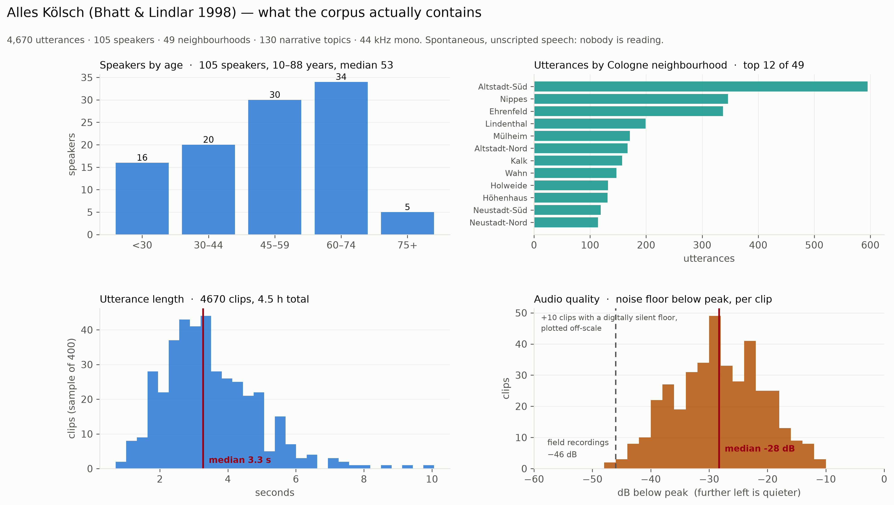
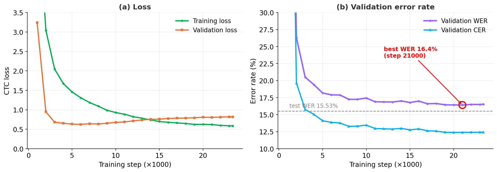
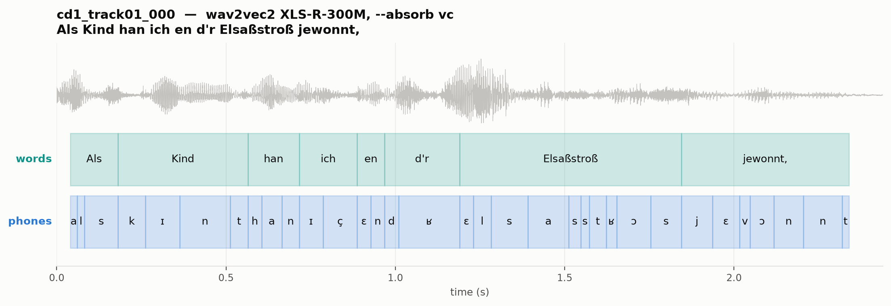
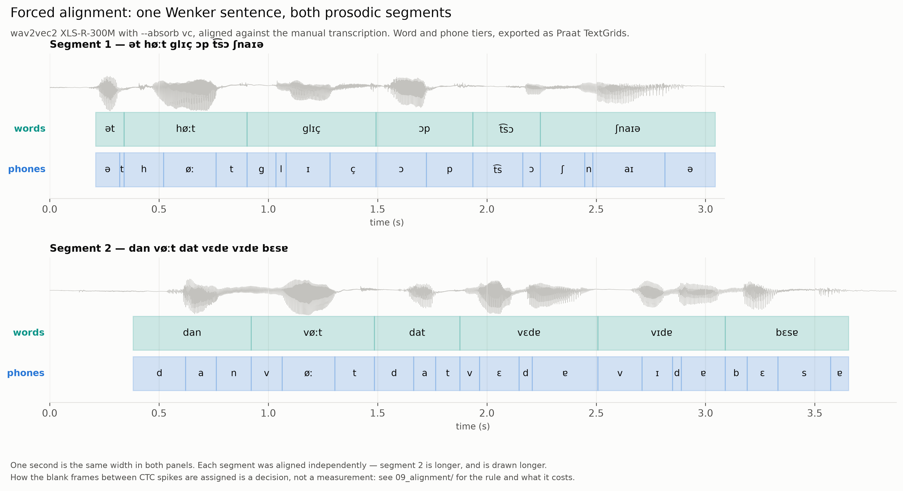

# Kölsch Phoneme Recognition

**Speech technology for Kölsch** (Ripuarian German, Cologne) — a reproducible
pipeline that turns a printed 1998 dialect corpus and its four audio CDs into a
fine-tuned phoneme recogniser, an orthographic recogniser, and phone-level
forced alignments.

Built during the **CIF Tandem Fellowship** at **IfL-Phonetik, University of
Cologne**, in tandem with **Jun.-Prof. Dr. Simon Rössig** and **Prof. Dr.
Reinhold Greisbach**, with the **Akademie för uns kölsche Sproch** as corpus
partner.

> **Kölsch has no public speech dataset and no standardised spelling.** Against
> the pretrained 152,766-word `german_mfa` dictionary, **94.1 % of Kölsch word
> tokens are out of vocabulary** — the dialect is simply not German text. Every
> design decision here follows from that.

| | |
|---|---|
| [The corpus](#the-corpus) | who is in it, and what the audio is like |
| [1 · OCR](#1--ocr-the-character-set-decides-the-project) | why the character set decided the project |
| [2–4 · Corpus, segmentation, normalisation](#24--from-narrative-to-training-units) | narratives → utterance-level training units |
| [5–8 · The models](#58--the-models) | how many, and which two ship |
| [Training and results](#training-and-results) | curves, test scores, and what they do not mean |
| [Get the models](#get-the-models-and-try-them) | two commands: transcribe, and align to a TextGrid |
| [9 · Forced alignment](#9--forced-alignment) | phone boundaries in time |
| [Install](#install) · [Layout](#repository-layout) · [Data and rights](#data-rights-and-consent) · [Citation](#citation) | |

---

## Quick start

```bash
git clone https://github.com/chemvatho/Koelsch-Phoneme-Recognition.git
cd Koelsch-Phoneme-Recognition
pip install -r requirements.txt

python tools/try_models.py transcribe data/segments/cd1_track01_000.wav
python tools/try_models.py align      data/segments/cd1_track01_000.wav
```

The models download themselves from the Hugging Face Hub on first use — nothing
else to set up. The second command writes a Praat TextGrid and a plot.

To run the notebooks instead, take them in order: stages 3 → 4 must precede 5,
7, 8 and 9, because stage 3 writes the segment manifest and stage 4 adds the
phonetic columns to it.

---

## The corpus

*Alles Kölsch. Eine Dokumentation der aktuellen Stadtsprache in Köln* — Bhatt &
Lindlar (1998), Akademie för uns kölsche Sproch. A book plus **four audio CDs of
spontaneous, unscripted narratives**: nobody is reading, and the transcriptions
are close-to-phonetic (*lautgenau*) but written with standard-German letters.



| | |
|---|---|
| **4,670** utterances, **4.5 h** | segmented from whole narratives |
| **105** speakers | 10–88 years old, median 53 |
| **49** Cologne neighbourhoods | Altstadt-Süd, Nippes and Ehrenfeld best represented |
| **130** narrative topics | *Die Dauergäste*, *Fastelovend nohm Kreech*, *Veedelszoch* … |
| **44.1 kHz mono**, median clip **3.3 s** | 0.8–10.1 s |

**Two things about this material set the ceiling for everything downstream.**

It is *spontaneous* speech — hesitations, laughter, overlap, dialect that shifts
mid-narrative — not the read citation forms most ASR corpora are built from.
That is what makes it worth having and what makes it hard.

And it is an **archival CD transfer**: the median clip's noise floor sits only
**28 dB below its peak**, against 46 dB for the studio field recordings used in
the alignment comparison. That difference is not cosmetic. It is why one of the
alignment cues documented in [section 9](09_alignment/) does not work on this
corpus at all, and the repository says so rather than shipping a rule that
quietly reads its landmarks off tape hiss.

Where the dialect sits: Kölsch is **Ripuarian**, in the Rhenish fan between the
**Benrath line** (*maken/machen*) and the **Uerdingen line** (*ik/ich*) — a
transition zone where dialect boundaries are defined by isogloss bundles that
mostly separate *consonant* realisations.

---

## 1 · OCR: the character set decides the project


OCR is the only route from a 1998 printed book to training data — without it the
four CDs are audio with no text to align to.

A classical OCR engine can only output a character that is **in its character
set**. A glyph it does not know is not flagged; it is silently replaced by the
nearest one it does know.

That single fact decided the project. *Alles Kölsch* prints two versions of every
text: a quasi-orthographic one in standard German letters, and a phonetic one in
**Rheinische Dokumenta**. The phonetic version is the linguistically richer
source and the one OCR destroys, because its diacritics are exactly the
characters no German-trained engine has.


Three engines were compared. **Tesseract** and **EasyOCR** both dropped the
elision apostrophes (`d'r`, `m'r`) and mangled the diacritics. **Gemini 2.5 Pro**,
prompted page by page, reads the page in context rather than glyph by glyph, and
was selected — then **every page was proofread against the scan by a human**.
OCR output is never taken as final.

→ [`01_ocr/`](01_ocr/01_ocr_digitisation.ipynb)

---

## 2–4 · From narrative to training units

Whole-narrative recordings are far too long to train on directly. Segmentation
is what makes the corpus usable.

| | |
|---|---|
| **2 · Corpus** | token/type counts, speaker demographics, phoneme distribution → [`02_corpus/`](02_corpus/02_corpus_statistics.ipynb) |
| **3 · Segmentation** | each WAV bound to its cleaned transcription, then **MMS forced alignment** at word level; one WAV per utterance, cut at the MMS word boundaries → [`03_segmentation/`](03_segmentation/03_mms_segmentation.ipynb) |
| **4 · Normalisation** | phonological rules + IPA phoneme tokeniser, dictionary-first G2P → [`04_normalisation/`](04_normalisation/04_phonological_normalisation.ipynb) |

A CSV manifest pairs each clip with its transcription, duration and speaker.
**Two target alphabets are prepared from the same audio**: the book's
German-letter orthography, and IPA via the Kölsch G2P and dictionary. Stages 3
and 4 must run in that order — stage 3 rewrites the manifest that stage 4 adds
columns to.

---

## 5–8 · The models

Stages 1–4 are shared. From there the same corpus feeds **two different
products**, not two competing runs:

| | **stage 5 — phonemes** | **stage 8 — orthography** |
|---|---|---|
| encoder | XLS-R-300M (~315M) | **w2v-BERT 2.0** (~580M) |
| input | raw waveform | 80-bin log-mel, stride 2 |
| target | IPA phoneme (48 symbols) | Kölsch grapheme |
| output | `d a t \| ə s ʊ` | `dat esu` |
| headline metric | **PER** | **CER** |
| notebook | [`05_finetune/`](05_finetune/05_wav2vec2_finetune.ipynb) | [`08_orthography/`](08_orthography/08_w2vbert_orthography.ipynb) |

Use phonemes for anything needing a phone inventory — TTS, alignment,
dialectometry — and orthography when you want text a Kölsch reader can read.
[`07_word_level/`](07_word_level/07_word_level_recognition.ipynb) fits word-level
IPA and orthographic heads on XLS-R for comparison, and
[`06_analysis/`](06_analysis/06_error_analysis.ipynb) does the error analysis.

**Also tried, and reported as such:** XLS-R-1B and 2B were explored in the
notebooks with no completed run stored. **Whisper was not attempted** — it is
future work, not a result.

Two things to know before comparing the two that did ship:

1. **W2v-BERT gets no German warm-start.** `facebook/w2v-bert-2.0` is a raw
   pretrained checkpoint with no CTC head, so `lm_head` *and* the conv adapter
   initialise randomly. The stronger multilingual pretraining has to pay for
   that. Do not assume the bigger model wins — measure it.
2. **CER is the headline for orthography, not WER.** With no spelling standard,
   *janz*/*ganz* and *zusamme*/*zosamme* are one word spelled two ways. WER
   charges full price.

---

## Training and results

wav2vec2 XLS-R-300M, phonemic CTC, **23,400 steps / 200 epochs** on four hours
of audio (9 h 32 m wall clock).



**Validation loss bottoms out around step 6,000 and then climbs while the error
rate keeps falling.** That is normal for CTC — select the checkpoint on error
rate, not on loss.

Recomputed from the stored test predictions:

| model | test set | | |
|---|---|---|---|
| **XLS-R-300M · phonemes** | 467 utterances, 21,463 reference phones | **PER 15.3 %** | CER 15.3 % |
| **w2v-BERT 2.0 · orthography** | 582 utterances | WER 34.0 % | **CER 11.3 %** |

For context, an off-the-shelf multilingual Wav2Vec2Phoneme scores ~33 % PER on
comparable German-dialect material (Xu et al., 2022) — this dialect-specific
fine-tune more than halves that.

> ### These scores are optimistic, and here is exactly why
>
> **Neither split is speaker-disjoint.** The phoneme model's 467-utterance test
> set shares **103 of its 105 speakers** with training. The orthography model's
> 582-utterance split was built at speaker level, but **22 % of its test clips
> (128/582) still come from a speaker seen in training**.
>
> With 105 speakers across 4.5 hours, a clean speaker-held-out split costs real
> training data — but until one is run, these numbers measure *how well the model
> transcribes voices it has already heard*, which is not the same question as how
> well it generalises. Treat them as an upper bound.

**Against a human annotator**, on a separate reference speaker (female, 81,
native monolingual Ripuarian, reading 40 Wenker sentences in studio conditions,
manually transcribed and annotated in Praat):

| | |
|---|---|
| Character error rate | **17.3 %** |
| Feature error rate | **8.1 %** |
| Mean boundary error | **22.7 ms** |
| Boundary deviations > 20 ms | 48.4 % |

The reference matters as much as the model. Scored against the *Standard German*
Wenker prompt instead of the dialect rendition, the same Kölsch model looks like
the worse system — penalised for correctly writing the dialect it heard.

---

## Get the models and try them

The checkpoints are **not in this repository** — they are 1.26 GB and 2.42 GB,
and GitHub rejects any file over 100 MB. They live on the **Hugging Face Hub**,
which is what `from_pretrained` reads:

| | Hugging Face | size | what it does |
|---|---|---|---|
| **IPA** | [`Vatho/koelsch-wav2vec2-ipa`](https://huggingface.co/Vatho/koelsch-wav2vec2-ipa) | 1.26 GB | phoneme transcription **and** forced alignment |
| **Orthography** | [`Vatho/koelsch-w2vbert-orthography`](https://huggingface.co/Vatho/koelsch-w2vbert-orthography) | 2.42 GB | Kölsch spelling |

*Published with [`tools/publish_to_hf.py`](tools/publish_to_hf.py) (`hf auth
login`, then `--push`); model cards
are in [`docs/model_cards/`](docs/model_cards/). If a link 404s, the upload has
not been run yet — point `KOLSCH_MODEL` and `KOLSCH_ORTHO_MODEL` at local
directories instead and everything below still works.*

### Task 1 — transcribe into Kölsch spelling · w2v-BERT 2.0

```bash
python tools/try_models.py transcribe data/segments/*.wav
```

```
cd1_track01_000.wav           2.44s  als kind han ich en der elsaßstroß jewonnt
cd1_track01_001.wav           2.82s  un zwar en däm stöckche zwesche merowingerstroß un bonner stroß
```

<details><summary>the same thing in eight lines of Python</summary>

```python
import torch, librosa
from transformers import Wav2Vec2BertForCTC, Wav2Vec2BertProcessor

proc  = Wav2Vec2BertProcessor.from_pretrained("Vatho/koelsch-w2vbert-orthography")
model = Wav2Vec2BertForCTC.from_pretrained("Vatho/koelsch-w2vbert-orthography").eval()

wav, _ = librosa.load("clip.wav", sr=16000)
with torch.inference_mode():
    ids = model(**proc(wav, sampling_rate=16000, return_tensors="pt")).logits.argmax(-1)
print(proc.batch_decode(ids)[0])
```
</details>

### Task 2 — transcribe, align, and get a TextGrid · wav2vec2 XLS-R-300M

```bash
python tools/try_models.py align data/segments/cd1_track01_000.wav \
    --text "Als Kind han ich en d'r Elsaßstroß jewonnt,"
```

Writes a Praat **TextGrid** with a word tier and a phone tier, plus a PNG drawn
the same way as the figures on this page:



**You do not need a transcript.** Leave `--text` off and the clip is decoded
first, then aligned to its own decode:

```
cd1_track01_000: decoded  als | kɪnt | han | ɪç | ən | dɐ | əlsastʁɔs | jəvɔn
cd1_track01_000: 30 phones, 8 words -> out_alignment/cd1_track01_000.TextGrid
```

That is the convenient path and the weaker one: **a forced aligner can only
return what you gave it**, so a recognition error becomes an alignment error.
Supply `--text` whenever you have a transcript. Here the decode lost the final
*t* of *jewonnt* and the alignment has no way to put it back.

---

## 9 · Forced alignment

Phone boundaries in time: the stage-5 model plus
`torchaudio.functional.forced_align`, exported as Praat **TextGrids** with a word
tier and a phone tier. No pronunciation dictionary needed beyond
`kolsch_g2p.py` — which is the point, given the 94.1 % OOV rate.



One Wenker sentence, cut into its two prosodic segments and aligned
independently with **`--absorb vc`**, the recommended setting.

**CTC is peaky**: the model emits one confident frame per phone and blanks in
between, so labelled frames cover only 14–21 % of the timeline. Roughly four
fifths of every phone duration in a CTC-derived TextGrid is therefore **a rule
deciding who gets the blank frames**, not a measurement — which makes the choice
of rule matter more than the model does.

**That whole argument, the eight gap rules, the comparison against MFA and MAUS
over 941 word boundaries, and the periodic-energy cue live in
→ [`09_alignment/`](09_alignment/).** Start there before trusting any duration
this pipeline produces.

---

## Roadmap

- [x] **Stage 1 — phoneme recognition.** OCR → corpus → segmentation →
      normalisation → XLS-R-300M fine-tune → error analysis.
- [x] **Stage 2 — orthography and alignment.** W2v-BERT 2.0 grapheme model
      (notebook 8) and phone-level forced alignment (notebook 9).
- [ ] **A speaker-disjoint re-split and re-evaluation**, so the headline scores
      measure generalisation rather than familiarity.
- [ ] **A hand-corrected alignment reference**, which is what the gap-rule
      question in section 9 is waiting on.
- [ ] **Stage 3 — TTS.** Reuse the aligned, phoneme-normalised corpus to train a
      Kölsch text-to-speech voice.
- [ ] **Shared resources.** Publish the pronunciation dictionary and the
      fine-tuned checkpoints to the Hugging Face Hub.

---

## Where it ran and where it didn't

Every notebook was executed in a clean kernel on this machine
(Python 3.12, torch 2.13 + CUDA, transformers 5.14.1, one NVIDIA GB10) using
[`tools/run_notebook.py`](tools/run_notebook.py). Status as tested:

| notebook | status | time | note |
|---|---|---|---|
| 2 · Corpus | **pass** | 2 s | |
| 3 · Segment | **pass** | 14 s | downloads MMS_FA, writes 55 segments |
| 4 · Normalise | **pass** | 4 s | must run *after* 3 — stage 3 rewrites the manifest |
| 5 · Fine-tune | **pass** | 812 s | full 150-epoch run on the example |
| 6 · Analyse | **pass** | 21 s | |
| 7 · Word-level | **pass** | 635 s | |
| 8 · Orthography | **pass** | 35 s | smoke run (`KOLSCH_SMOKE=1`), 2 optimiser steps, downloads w2v-BERT 2.0 |
| 9 · Alignment | **pass** | 24 s | 55 TextGrids written |
| 9b · Gap rules | **pass** | 38 s | every rule measured on the shipped example |
| 9c · Periodic energy | **pass** | 48 s | reports the cue is absent in this audio, and withholds `pe` |
| 1 · OCR | **not run** | — | needs the Tesseract **binary** and a `GEMINI_API_KEY`; neither is available in a headless test |

Three real bugs surfaced and were fixed rather than worked around:

- **`group_by_length` was removed in transformers 5.0**, so stage 5 raised
  `TypeError` on any current install. The cell now filters its kwargs against
  `TrainingArguments`' actual signature and prints what it dropped — one notebook
  that works on both 4.x and 5.x, instead of a version pin that will rot.
- **Stage 6's confusion plot crashed when there were no substitutions**
  (`M.max()` on a 0×0 array raises rather than returning 0). It now says so and
  returns.
- **`opencv-python` was missing from `requirements.txt`** although stage 1
  imports `cv2`. Added, along with `scikit-learn` and a note that the Tesseract
  binary cannot come from pip.

**On the shipped example, training notebooks prove the wiring, not the model.**
`data/` holds one recording by one speaker, so there is nothing to hold out: the
split falls back to random, train and test share a voice, and any score is
memorisation. Both notebook 8 and notebook 7 say so at runtime. Scale `data/` up
before believing a number.

Notebook 9's demo on that example measured CTC covering **31 %** of the span and
`vc` moving vowels **+15.8 ms** and consonants **−6.9 ms** on average — the
expected direction, on 33 phones.

---


---

## Data, rights and consent

`data/` ships **one worked example** so the pipeline runs out of the box:

| file | what it is |
|---|---|
| `pages/page_1.png` | scan of the printed transcription page |
| `audio/track1_mono.wav` | CD 1, track 01 — 2.8 min, *"Tee mit Schuss"* |
| `transcripts/page_1.txt` | the OCR output for that page, human-proofread |
| `index.csv` | one row per recording, with the book's own speaker metadata |
| `lexicon.csv` | Kölsch orthography → IPA, generated by `kolsch_g2p.py` |

**Source and rights.** The page and the audio are from *Alles Kölsch*
(Bhatt & Lindlar, 1998), published by the **Akademie för uns kölsche Sproch**,
which holds the rights. One page and one track are included as a worked example
so the pipeline runs out of the box.

> **They are excluded from this repository's MIT licence, which covers the code
> only.** Nothing here grants you a licence to the corpus. To use or
> redistribute the page or the audio — or to obtain the full corpus, which is
> not published here — contact the Akademie för uns kölsche Sproch.

**Speaker metadata.** `index.csv` carries the speaker's name, age, occupation and
neighbourhood. These are reproduced from the book's own published speaker table,
where they have been in print since 1998; nothing here discloses more than the
publication does. If you extend `data/` with recordings that are *not* already
published, do not copy this pattern — use an opaque speaker id.

**Everything downstream runs locally.** The recogniser is fine-tuned in-house,
alignment runs offline, and audio, lexicon, phone inventory and TextGrids never
leave your machine. The two exceptions are opt-in and named as such: Gemini reads
the **printed page** in notebook 1, and MAUS is an **optional** comparison
baseline in notebook 9. A workable rule: *published text may travel; speaker
recordings should not.*

---

## Install

```bash
pip install -r requirements.txt
```

Notebook 1 additionally needs the Tesseract **binary**, which pip cannot install:

```bash
apt-get install tesseract-ocr tesseract-ocr-deu     # Debian/Ubuntu
brew install tesseract tesseract-lang               # macOS
```

and a Gemini key in the environment:

```bash
export GEMINI_API_KEY=...        # never commit this
```

The models are fetched from the Hub by default. To use local checkpoints
instead, point the environment at them:

```bash
export KOLSCH_MODEL=/path/to/kolsch_wav2vec2_model      # IPA + alignment
export KOLSCH_PROCESSOR=/path/to/processor              # defaults to KOLSCH_MODEL
export KOLSCH_ORTHO_MODEL=/path/to/w2vbert_ortho_model  # orthography
```

Every notebook locates the repository root from `kolsch_paths.py`, so it runs
identically in VS Code, Jupyter and Colab regardless of the working directory.

---

## Repository layout

```
01_ocr/ … 09_alignment/     one notebook + README per stage
data/                       the worked example (see rights above)
docs/figures/               figures used by this README and the stage READMEs
tools/try_models.py         transcribe, align, plot — the two tasks above
tools/publish_to_hf.py      upload the checkpoints to the Hugging Face Hub
tools/run_notebook.py       executes a notebook and reports where it stops
docs/model_cards/           what each published checkpoint is, and its caveats
kolsch_align.py             the aligner and all eight gap rules, in one place
kolsch_periodic.py          periodic energy, after ProPer — the cue `pe` reads
kolsch_plot.py              waveform + word tier + phone tier, as drawn above
kolsch_g2p.py               rule-based Kölsch grapheme→phoneme converter
kolsch_paths.py             single source of truth for paths
requirements.txt
```

`models/` is generated and git-ignored. Checkpoints go to the Hugging Face Hub,
not into git — `tools/publish_to_hf.py` does that, and refuses to upload
anything without an explicit `--push`.

---

## Citation

```bibtex
@misc{chem2026koelsch,
  author = {Chem, Vatho and R\"ossig, Simon and Greisbach, Reinhold},
  title  = {K\"olsch Phoneme Recognition: an open pipeline from a printed
            dialect corpus to phoneme recognition and forced alignment},
  year   = {2026},
  note   = {CIF Tandem Fellowship, IfL-Phonetik, University of Cologne},
  howpublished = {\url{https://github.com/chemvatho/Koelsch-Phoneme-Recognition}}
}
```

Corpus: Bhatt, C. & Lindlar, M. (1998). *Alles Kölsch: eine Dokumentation der
heutigen Sprache in Köln*. Akademie för uns kölsche Sproch.

## Licence

**MIT** for the code and notebooks. **Not** for `data/` — see
[Data, rights and consent](#data-rights-and-consent).

## Acknowledgements

Developed under the **CIF Tandem Fellowship** at IfL-Phonetik, University of
Cologne, in tandem with **Simon Rössig**. With thanks to **Martine Grice**,
**Constantijn Kaland**, and **Reinhold Greisbach** (co-author of the
phoneme-recognition study), and to the **Akademie för uns kölsche Sproch** as
corpus partner. Built on Meta AI's Wav2Vec2 / XLS-R / w2v-BERT and MMS, and
Hugging Face Transformers.
